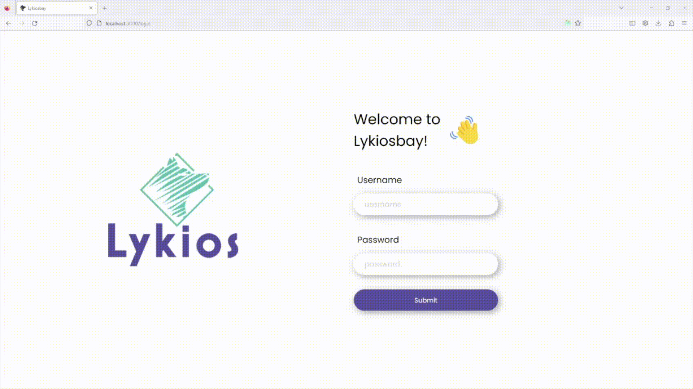

# Lykiosbay - User manual
## Logging in
Logging in happens on the `/login` page where the user is prompted to fill in a username and password. On submission, the input fields are validated not to be empty. A login request gets sent and the returned access token gets stored in the localstorage.

## View auctions
After logging in, the user is redirected to the overview page which is also the home page of the application. The contents of this page vary according to whether the user is a bidder or admin.

If the user is a bidder, he/she sees an overview of all auctions that are currently going on or auctions that have ended. Each of these auctions show some information about the details of the auction. The most important are the thumbnail, status and time left. The thumbnail is the most important picture describing the item sold in the auction. This thumbnail can be shown in large by clicking on it. The status can have 6 different values of which the meaning is shown in the legend. The time left shows the amount of time that is left to make a bid on this auction, or ‘ended’ if the auction is ended. The button of each auction displays ‘bid from &lt;amount&gt;’ if the user can make a bid on this auction or ‘check out’ if the user cannot.

Admins see an extended content of the view of bidders. Admins can also see auctions that are created but are not started yet and auctions that are closed. Each auction also displays this state in the card.

Now the user can click on the button of an auction to see its details. The user is redirected to the details page of that auction. On this page, also the description and some additional pictures are shown. The user can click the picture thumbnail to see it in big.

Admins see some additional info on the details page. The admins also see the list of bids made on this auction and who made these bids. Since admins target a different endpoint than bidders, bidders won’t be able to see who made which bid because this is private. The winning bid is distinguished by a crown and will be shown on top. 

### Bidder:

### Admin:

## Making a bid
Bids can be made on the details page by both bidders and admins. The bid form is only shown when the auction is ongoing and the logged in user doesn’t have the highest bid. Above the input field, the application tells the user how much the minimum bid is at the moment. The bid gets validated when the user clicks the bid button. Only if the bid is the minimum or higher, the confirmation popup is shown, otherwise a message is shown to inform the user of the minimum bid. If the user confirms the popup, the ui is updated immediately.

## Manage auction (admin)
A functionality solely for administrators is managing auctions. This includes all CRUD operations concerning auctions.

### Create an auction

Creating an auction can be done via the overview page. In the bottom right corner there will be a button to add a new auction. This brings the user to the auction form page where the admin has to fill in all details of the auction. The admin also has to upload one picture of the item to be sold. Multiple images are allowed. These images are managed locally and can be reordered or deleted again. It is only when the form is submitted these images are uploaded to the server. Creating an auction happens in one request containing the auction info and the uploaded images. When the filled in values are not valid, the custom validator kicks in and notifies which fields are wrong. After creating a new auction, the user navigates to the details page of that auction.

### Update an auction

Updating an auction is done by going to the details page of an auction and then clicking the update button. This brings the admin to the auction form page with the details of the auction already filled in. Now, the pictures are a combination of local images and the initial images from the server. These can still be managed in the same way as in the create as there won’t be a visual difference between the pictures from the server and the uploaded images. Different than on the create auction page, this page shows a topic with all the bids made on the auction, the admin can remove bids from this list.

Some fields will not be editable after a certain precondition is met. The opening price cannot be changed when there are already bids made. Likewise is it impossible to change the start date when the auction is already ongoing.

Similarly to the create action, there will be only one request sent to the backend when the form is submitted.

### Delete (soft) an auction

Archiving auctions means that auctions will be deleted visually. Since we don’t want auctions to get effectively lost on deletion, we’ve opted for a soft deletion where auctions don’t get removed from the database. Archiving auctions is done via the edit auction page with the archive button. Upon clicking this button, a confirmation popup is shown. When confirmed, a request is sent to the backend and the auction will be archived. The ui is updated immediately.

## Close auction (admin)
Closing an auction is also an operation that can only be done by administrators. Closing an auction means that the highest bidder for an auction will get the item that is auctioned off. Auctions can only be closed when it's ongoing or ended and the auction has any bids. When the admin wants to close an auction that is still ongoing, it will be possible, but he/she gets a popup to notify that the auction isn’t ended yet and closing this auction now may lead to unfair results.

To close an auction, some invoice data needs to be filled in. The invoicing form shows the most important info of the auction above to help the admin fill in the form. If the form is submitted, the auction will be closed and not visible anymore for bidders. The amount and invoice date are calculated on the server. The invoice is saved together with the auction and will now be shown on the details and edit pages.

